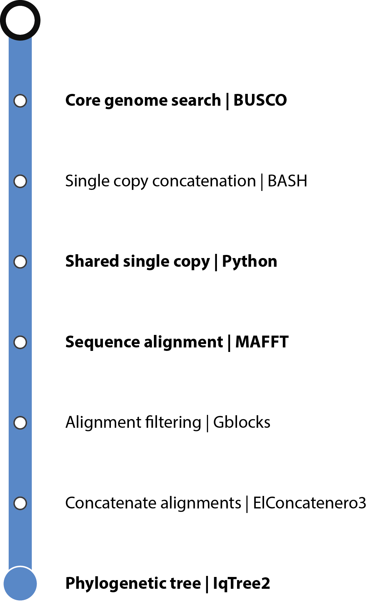

# **PALLOR: Phylogeny from universAL singLe cOpy oRthologs**

[](https://www.nextflow.io/)
[](https://www.docker.com/)
[](https://sylabs.io/docs/)

# Introduction

PALLOR is a bioinformatics workflow used to create in a fast way phylogenetic tree from (un)annotated genomes. It can be useful for genome assembly projects when you have your draft assembly and before did any structural annotation process.

Steps of the workflow:
- Make BUSCO analysis on each genome and extract single copy genes (amino acid)
- Concatenate all single copy genes files into a uniq file
- Extract single copy genes shared by a minimal number of species
- Make the alignment (Mafft)
- Clean it (Gblocks)
- Concatenate alignments into a matrix (ElConcatenero)
- Make the tree (IQ-TREE 2)

## Dependencies

- Nextflow >= 20.04.x
- Singularity or Docker

## Quick start

1. Clone the current gitlab repertory 

```
git clone https://gitlab.ifremer.fr/bioinfo/pallor.git
```

2. Add a directory with your data (fasta files of genomes with ```.fna``` extension). It should be look like:

```
pallor/
├── augustus
├── bin
├── conf
│   ├── base.config
│   ├── custom.config
│   ├── reports.config
│   └── resources.config
├── containers
├── LICENSE
├── main.nf
├── nextflow.config
├── README.md
└── test_data
    ├── GCA_000738915.1_Nema_sp_1_ERTm6_V2_genomic.fna
    ├── GCA_001432165.1_ASM143216v1_genomic.fna
    ├── GCA_001642395.1_ASM164239v1_genomic.fna
    ├── GCA_001642415.1_ASM164241v1_genomic.fna
    ├── GCA_001887945.1_ASM188794v1_genomic.fna
    ├── GCA_002081675.1_ASM208167v1_genomic.fna
    ├── GCA_002087885.1_ASM208788v1_genomic.fna
    ├── GCA_002087915.1_ASM208791v1_genomic.fna
    ├── GCA_004000155.1_ASM400015v1_genomic.fna
    ├── GCA_004325065.1_BEOM2_v1_genomic.fna
    ├── GCA_004325075.1_ILG3_v1_genomic.fna
    ├── GCA_014805555.1_ASM1480555v1_genomic.fna
    ├── GCA_015832245.1_ASM1583224v1_genomic.fna
    ├── GCF_000091225.1_ASM9122v1_genomic.fna
    ├── GCF_000146465.1_ASM14646v1_genomic.fna
    ├── GCF_000277815.2_ASM27781v3_genomic.fna
    ├── GCF_000280035.1_ASM28003v2_genomic.fna
    ├── GCF_000760515.2_UGP1.1_genomic.fna
    ├── GCF_000803265.1_ASM80326v1_genomic.fna
    ├── GCF_000988165.1_ASM98816v1_genomic.fna
    └── ncbi_dataset.zip
```


3. Run the analysis

```
nextflow run main.nf -profile custom,singularity
```

## Parameters

- ```--rawdata_dir [path]```: Path to input directory with raw data files with ```.fna``` extension
- ```--name [str]```: Name for the pipeline run. If not specified, Nextflow will automatically generate a random mnemonic
- ```--projectName [str]```: Name of the project being analyzed
- ```--odb_path [path]```: Path to all BUSCO ODB databases
- ```--odb_name [str]```: Specify the name of the BUSCO lineage to be used
- ```--min_species [int]```: Keep orthologs presents in a least ```--min_species``` minimal number of species (min:2; max: total number of species)

For ```--min_species``` be careful as low value can dramatically increase the running (many shared single copy genes, i.e. very long alignment) and high value can lead to the absence of shared single copy genes. 

## Examples

- 1 - Run using Singularity on 20 microsporidia species on a local computer

```
nextflow run main.nf -profile base,singularity --projectName run-test --rawdata_dir test_data/ --min_species 18 --odb_path /home/ref-bioinfo/tools_data/busco/v4 --odb_name microsporidia_odb10
```

- 2 - Run using Docker and parameters set in conf/custom.conf

```
nextflow run main.nf -profile custom,docker
```

- 3 - Same with HPC configuration

```
nextflow run main.nf -profile custom,docker -c /appli/bioinfo/hpc/nextflow/ifremer.config
```

- 4 - Restart a run partially failed

```
nextflow run main.nf -resume -profile custom,docker -c /appli/bioinfo/hpc/nextflow/ifremer.config
```

## Workflow process




## License and Credits
PALLOR is released under the GNU Affero General Public License, Version 3.0. AGPL

It is developped by Alexandre Cormier, bioinformatics engineer at the bioinformatics service of IFREMER (SeBiMER).

-- (c) 2020 - SeBiMER, Ifremer
